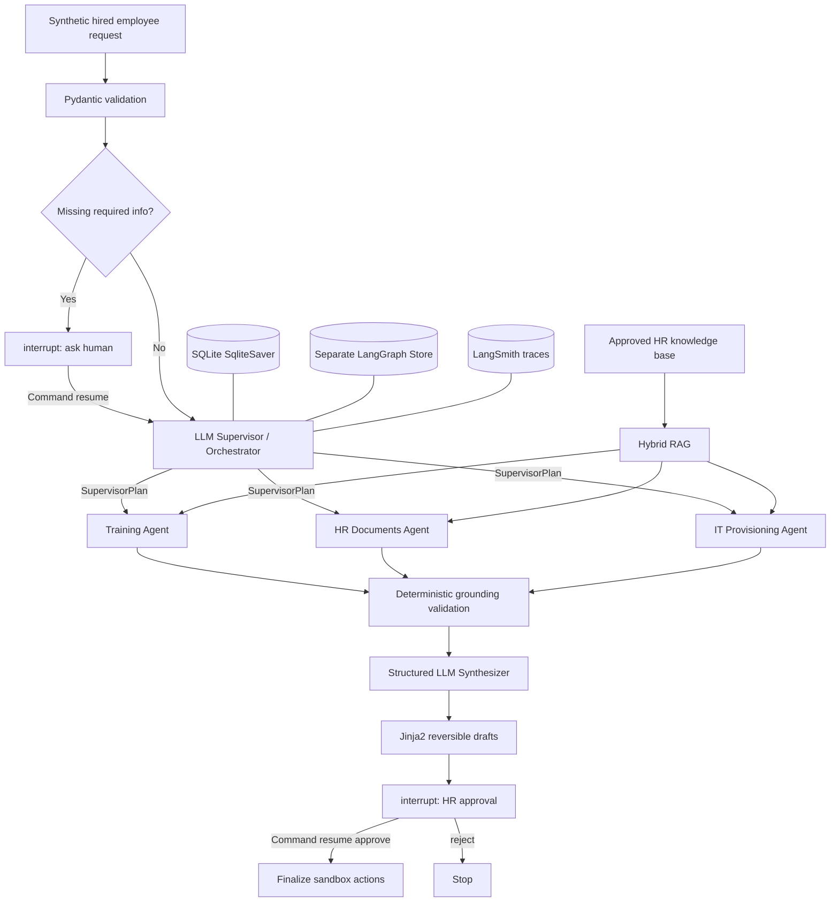

# Architecture

## Declared multi-agent track

**Track A — Supervisor + Workers.**

A dedicated LLM supervisor is the only component that decomposes/delegates work. Specialist
workers do not select one another.

## Explicit workflow pattern

**Orchestrator-Worker.**

The course defines this pattern as an orchestrator that breaks a task into subtasks, delegates
those subtasks to workers, and synthesizes their outputs. OnboardAI implements all three parts:

1. `SupervisorPlan` dynamically creates worker assignments.
2. Training, HR Documents, and IT Provisioning agents execute the assignments.
3. `SynthesisResult` combines the worker outputs before human review.

## Flow

## Hybrid RAG

The project deliberately combines:

- **deterministic retrieval** of mandatory role/policy evidence, and
- **agentic retrieval tool calls** chosen by each specialist LLM.

This gives the HR workflow control over mandatory evidence while still allowing contextual
searches, which matches the course distinction between fixed RAG chains and RAG agents.

## State model

- Short-term workflow state: `SqliteSaver`, scoped by `thread_id`.
- Long-term employee preferences/training facts: separate `InMemoryStore`, scoped by employee
  namespace and independent of `thread_id`.
- Production note: `InMemoryStore` crosses threads but does not survive a process restart.
  `PostgresStore` would be the production replacement.

## Consequential-action boundary

Before the IT ticket can move from DRAFT to APPROVED and before approved training facts are
written, the workflow calls `interrupt()`. The same thread must be resumed with
`Command(resume=...)`.
